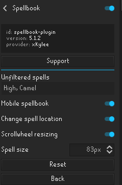
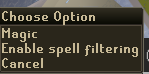

# telealcher
OSRS Python bot for telealching to 99 magic.

## Requirements

1080p screen resolution. (Can easily be changed by changed all values of 1919 and 1079 to your resolutions)

pyautogui
pyclick
numpy

## Instructions

Assuming you have python installed open terminal and type:

pip install pyautogui
pip install pyclick
pip install numpy

Try pip3 if you get errors.

### In OSRS.

Use the spellbook plugin to filter only high alchs and camelot teleports, and I use a size 83 spell size.

Right click spell book icon, then click enable spell filtering.

Use screen markers to mark the camelot tele and the item you'll be alching and put it in the top right of your inventory.

run the program by opening terming and using cd to change the directory to the scripts location, and type python main.py (Or python3 if you get errors.)